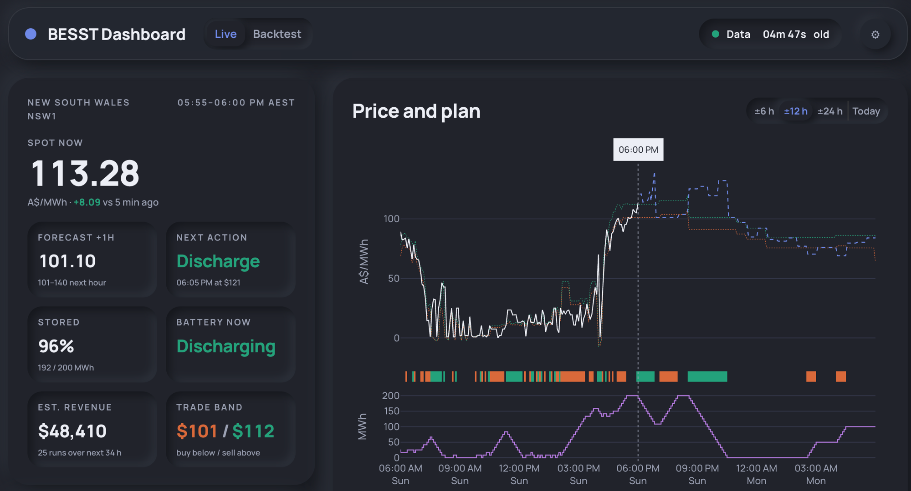
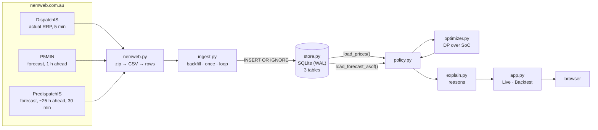
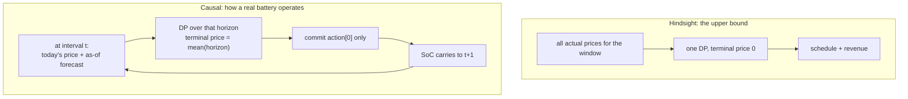

# BESS NSW1: battery arbitrage on AEMO market data

A 200 MWh grid battery in the NSW1 region of the Australian National Electricity Market. The tool ingests AEMO's five-minute dispatch prices and price forecasts, decides when to charge and discharge, and shows a trader why.



The Live tab. Spot price top left, the plan's next action and thresholds below it, and on the right today's actual prices in white running into AEMO's dashed forecast, with the plan as a tape under the chart and state of charge in the lower panel. Shown in dark mode with the sidebar's "Green sells" option, which swaps the default trade colours, so here green is discharging and orange is charging.

---

## What this dashboard is for

A battery earns money by buying energy cheaply and selling it dearly, and in the NEM the price moves every five minutes. Someone operating that battery has to answer three questions all day:

1. **What should the battery do in the next five minutes?** Charge, discharge, or sit still, and at what price does the answer flip?
2. **Why?** A number on a screen that says "discharge" is not actionable. The reason has to be checkable against the chart in front of them.
3. **How much is the forecast costing us?** A real operator only sees past prices plus AEMO's published forecast. Perfect foresight is worth more. The gap between the two is the price of not knowing the future, and it is the number that tells you whether a better forecast is worth building.

The **Live** tab answers 1 and 2. The **Backtest** tab answers 3. It runs the same optimiser twice over the same historical prices, once with perfect foresight and once seeing only what was knowable at the time, then reports the share of the perfect-foresight revenue the realistic run captured along with the individual intervals where the gap opened.

It is a decision-support and forecast-evaluation tool, not a trading system: nothing here places a bid.

---

## Dependencies

**Runtime:** Python ≥ 3.11 and [`uv`](https://docs.astral.sh/uv/getting-started/installation/). That is all you install by hand; `uv sync` handles the rest from `uv.lock`. There is no database server, no message broker, no node toolchain.

| Package | Why |
|---|---|
| `pandas` ≥ 2.2 | Time-indexed price series; the five-minute grid, the as-of forecast stitch, and the group-bys behind the daily tables |
| `numpy` ≥ 1.26 | The dynamic program's value function, as vectorised array updates over the state-of-charge grid |
| `requests` ≥ 2.32 | Fetching nemweb zips, with a session and a retry/backoff |
| `dash` ≥ 2.17 | The web app, its callbacks, and the browser-side state |
| `plotly` ≥ 5.22 | The charts (installed anyway as a Dash dependency; used directly) |
| `dash-mantine-components` == 0.14.7 | UI controls: switches, number inputs, tables. Pinned to an exact version, not a floor |
| `pytest` ≥ 8 | `[dev]` extra only |

Stdlib does the rest on purpose: `sqlite3` for storage, `zipfile`/`csv` for the AEMO files, `threading` for the ingest loop, `functools.lru_cache` for memoisation, `argparse` for the CLI.

**Currently installed** (`.venv`, Python 3.12.13): pandas 3.0.5, numpy 2.5.2, requests 2.34.2, dash 4.4.1, plotly 7.0.0, dash-mantine-components 0.14.7, pytest 9.1.1.

---

## Run it

```bash
make demo      # committed snapshot, no network: serve http://127.0.0.1:8050 straight away
make setup     # fresh clone: install deps, backfill ~10 recent days from nemweb, then serve (5-10 min)
make up        # already set up: just serve
make up-bg     # same, detached: survives closing the terminal
make down      # stop whatever is serving, foreground or detached
make snapshot  # re-cut data/snapshot.sqlite from the live store
make test      # uv run pytest -q
```

**`make setup` takes 5 to 10 minutes**, so go and grab a cup of coffee. Almost all of it is the backfill: it pulls roughly ten days of DispatchIS, P5MIN and Predispatch files from nemweb one at a time, and nemweb's throughput is the limit, not your machine. It prints each file as it lands so you can see it moving. If you would rather not wait, `make demo` serves the committed snapshot instantly with no network at all.

| Target | What it actually does |
|---|---|
| `demo` | `uv sync --extra dev`, copies `data/snapshot.sqlite` → `data/demo.sqlite`, serves with `BESST_DEMO=1`. The scratch copy keeps the committed snapshot pristine; `BESST_DEMO` also disables the ingest thread, so the demo makes **no network calls at all**. Start here. |
| `setup` | Checks `uv` exists, `uv sync --extra dev`, backfills `data/nem.sqlite` if empty, then `make up`. The backfill range is computed from *today* (`FROM = today-11`, `TO = today-2`), never hardcoded. See [Data expiry](#data-expiry-drives-the-backfill-window). |
| `up` | `PORT=$(PORT) uv run python app.py`. Foreground; dies when you close the terminal. Picks the first free port at or above `PORT`, then opens a browser tab at the served URL about 1.5 s after start, unless `BESST_NO_BROWSER` is set. |
| `up-bg` | The same command under `nohup`, logging to `app.log`, pid in `.app.pid`. Refuses to start if the port is already serving. The guard is on the port rather than the pidfile, so it also catches a foreground `make up` and a stale pidfile. Without it a second start would bind-fail into the log while orphaning the first server. |
| `down` | Kills both the backgrounded server and a foreground `make up` (which leaves no pidfile, so the port is the second place to look). Each candidate pid is matched against its own command line before being signalled, because port 8050 is a common default and someone else's stray dev server is not ours to kill. |
| `snapshot` | `uv run python snapshot.py`: NSW1-only copy of the live store, vacuumed, journal mode `DELETE` so the committed artefact is one file rather than three. ~31 MB → ~6 MB. |

**Ports**

Nothing is hardcoded. The server starts at `PORT` (default 8050) and, if that is in use, walks up to the first free port in the next 20 and prints `port 8050 is in use, serving on 8051 instead`. The browser tab follows the port actually chosen, and under `BESST_DEBUG` the reloader keeps it rather than drifting on each edit.

The one target that does not do this is `make up-bg`, which still refuses to start when `PORT` is busy. That is deliberate: it records a pid so `make down` can stop it later, and silently moving a detached server to another port is how you end up with servers you cannot find. For a background server on a busy port, name it: `make up-bg PORT=8051`.

**Windows, or anywhere without `make`**

The Makefile is POSIX-only: `up-bg` and `down` use `nohup`, `lsof` and `ps`, and Windows has no `make` to begin with. Every target is only ever a couple of `uv` commands, and those are identical on every platform. `uv run` syncs the environment before it runs anything, so there is no separate install step.

Pick one of the two ways in. Both assume you have cloned the repo and are sitting in it, with [`uv`](https://docs.astral.sh/uv/getting-started/installation/) installed.

*Option A, the committed snapshot.* No network, no waiting, running in seconds. This is `make demo`, and it is the one to use on a fresh clone.

```powershell
Copy-Item data\snapshot.sqlite data\demo.sqlite
$env:BESST_DB = "data\demo.sqlite"
$env:BESST_DEMO = "1"
uv run python app.py
```

*Option B, live data from nemweb.* This is `make setup`: it fills `data\nem.sqlite` with about ten recent days, takes 5 to 10 minutes, and then serves. Go and grab a cup of coffee.

```powershell
$from = (Get-Date).AddDays(-11).ToString('yyyy-MM-dd')
$to   = (Get-Date).AddDays(-2).ToString('yyyy-MM-dd')
uv run python -m besst.ingest --from $from --to $to
uv run python app.py
```

Compute those dates rather than pasting fixed ones. Predispatch lives in nemweb's Current folder for only about 15 days, so a range written down today stops being fetchable in a fortnight and the ingest fails with a `LookupError`. This is the same reason the Makefile derives `FROM` and `TO` from today.

After Option B the store persists, so `uv run python app.py` on its own is all you need next time.

Either way the server holds the terminal and prints the URL it chose. Stop it with Ctrl-C. The rest of the targets:

| Instead of | Run |
|---|---|
| `make up` | `uv run python app.py` |
| `make down` | Ctrl-C in the terminal running it |
| `make test` | `uv run --extra dev pytest -q` |
| `make snapshot` | `uv run python snapshot.py` |
| `make up PORT=8051` | `$env:PORT = "8051"; uv run python app.py` |
| `make up-bg` | `Start-Process uv -ArgumentList 'run','python','app.py' -RedirectStandardOutput app.log` |

In `cmd.exe` rather than PowerShell, set variables with `set BESST_DEMO=1` and copy with `copy data\snapshot.sqlite data\demo.sqlite`. Under WSL or Git Bash the Makefile itself works as written, so `make demo` and `make setup` are available there unchanged.

**Environment variables**

| Variable | Effect |
|---|---|
| `PORT` | Port to *start looking* at (default 8050). If it is taken the server steps up to the next free one and prints which. `make up PORT=8051` to start the search elsewhere. |
| `BESST_DB` | Path to the SQLite store (default `data/nem.sqlite`). |
| `BESST_DEMO` | Set → no ingest thread. Used by `make demo`. |
| `BESST_NO_BROWSER` | Set → never open a browser tab on startup. Headless unix is detected already; this is the manual override. |
| `BESST_DEBUG` | Set → Dash debug + hot reloader. **Leave it off for anything you leave running**: the reloader forks a second process, and each process starts its own ingest thread polling nemweb. |

**Data, directly**

```bash
uv run python -m besst.ingest --from 2026-08-29 --to 2026-09-04   # backfill any range, safe to re-run
uv run python -m besst.ingest --once                              # fetch whatever is newer than the store
uv run python -m besst.ingest --loop                              # poll every 5 minutes (separate process)
uv run pytest
```

The package installs a `besst` console script pointing at the same entry point, so `uv run besst --once` is equivalent to the second line.

Every ingest is idempotent: backfill, loop and a manual re-run can overlap without corrupting the store.

---

## What you are looking at

**Live tab.** Today's actual prices so far, AEMO's forecast ahead, and the battery's plan drawn over the forecast.

The two dotted lines are the optimiser's decision thresholds. The lower one is the *storage value*: what one more MWh in the tank is worth right now. The upper one is that value divided by efficiency. The battery charges when price falls below the lower line, discharges when it rises above the upper one, and holds in between. That is the entire decision rule, and every interval carries a one-sentence reason built from it.

Reading the rest of the chart: the coloured tape along the bottom of the price panel is the plan, green for charging (buying) and orange for discharging (selling), and the lower panel is energy stored in MWh. The window buttons pick how many hours around now to show; drag on the chart to zoom, double-click to snap back to the preset.

Three **layer chips** under the chart control what else is drawn, and only *Thresholds* is on by default. *Typical range* adds a faded band behind the prices: the 10–90% range of the prior 7 days at the same time of day, median dotted, so you can see whether today is normal. *Shade charge/discharge* washes the whole panel in the trade colour instead of just the tape.

The sidebar has a dark mode, a 12/24-hour clock, and a switch for which side of the trade is green.

Starting the server opens `http://127.0.0.1:$PORT` in your default browser about 1.5 seconds in, on macOS, Windows, and Linux or BSD with a display. A headless unix box opens nothing, because there the standard library would launch a text browser like lynx over the very terminal running the server. Under `BESST_DEBUG` only the launching process opens a tab, so saving a file reloads the server without piling up tabs, and `BESST_NO_BROWSER=1` turns it off entirely.

**Backtest tab.** A fixed last-7-days window over the store. Drag the slider under the price chart to zoom into a day. Two runs over the same prices:

- *Hindsight*: knows every price in advance. The best any trader could have done.
- *Causal*: at each interval sees only past prices plus the AEMO forecast available at that moment.

The headline is the share of hindsight revenue the causal run captured. The worst-decisions table shows where the gap opened, and explains why using the same reason strings as the Live tab.

Both tabs read the same battery inputs, but the input card itself sits in the Live tab, so changing power, capacity or efficiency means switching back to Live to do it.

---

## Architecture

Seven modules, ~450 lines of logic, plus a 600-line Dash app. One process serves and ingests.

```
besst/nemweb.py     fetch + parse AEMO MMS files      three report families, one parser
besst/store.py      SQLite: prices, forecasts         idempotent upserts, as-of forecast reads
besst/ingest.py     CLI + the 5-minute poll loop      backfill / --once / --loop
besst/battery.py    Battery(power, capacity, eff)     a frozen dataclass, 13 lines
besst/optimizer.py  the dynamic program               actions + SoC + decision thresholds
besst/policy.py     hindsight / causal simulations    receding horizon over the as-of forecast
besst/explain.py    Action -> one English sentence    reads the DP's own thresholds
app.py             the Dash dashboard                two tabs, cached recomputes
snapshot.py        cut the committed demo database
```

### Data flow



The ingest loop runs as a **daemon thread inside the Dash process** (`app.py`, guarded by `BESST_DEMO`), so there is nothing to cron and nothing to babysit. It fetches just after each five-minute boundary and retries until the interval's price actually lands, because AEMO's publication time within an interval varies from ~10 s to over a minute and a poll that finds nothing new raises nothing.

### The optimiser

A dynamic program over a discretised state of charge. With the defaults (100 MW / 200 MWh) one interval moves `100 MW × 5/60 = 8.33 MWh`, giving a 25-state grid, and three actions per interval:

```
V[T, s] = s · step · terminal_price · efficiency          terminal value: don't dump the tank

V[t, s] = max( V[t+1, s]                              ,   idle
               V[t+1, s+1] − price[t] · step          ,   charge:    buy one step
               V[t+1, s−1] + price[t] · step · eff )      discharge: sell one step, efficiency haircut
```

Backward induction fills `V`, a forward pass walks the chosen path. The *slope* of `V` at the current state is the **storage value**: what one more MWh in the tank is worth. It is exactly the price above which selling pays and below which buying pays. That slope is what the chart draws and what `explain.py` puts into words, so the sentence a trader reads is the solver's own rule, not a story written afterwards.

Cost is `O(T × S)` vectorised over `S`: a week of hindsight runs in a few milliseconds.

### The two policies



The **as-of forecast** is the whole point of the causal run: for a decision at time *t* it uses the newest P5MIN run for the next hour, then the newest Predispatch run beyond it, and nothing published after *t*. Predispatch is half-hourly and labelled by period end, so it is back-filled onto the five-minute grid; the five-minute run overrides it wherever both exist. Terminal value is the horizon mean, so the plan does not dump its energy just because the horizon ended.

### The dashboard

Two tabs, one set of battery inputs shared between them. Both heavy computations are memoised with `functools.lru_cache`: `live()` on `(newest price, region, power, capacity, efficiency, newest forecast run)`, `backtest()` on the same minus the price and plus the date range. Stamping the newest forecast run into the key is what makes the cache self-invalidating, so a theme toggle or a zoom is free and the plan is recomputed only when new data has actually landed. The Live callback additionally short-circuits with `PreventUpdate` when the 30-second tick fires and nothing in the key changed.

---

## Decisions, and why

### Data expiry drives the backfill window

DispatchIS and P5MIN keep a year of daily archives. **Predispatch has no archive and only ~15 days in Current.** A hardcoded date range therefore stops being fetchable a fortnight after it is written, so the Makefile computes `FROM`/`TO` from today. The range also stops two days back, where the daily archives end; the ingest thread fills the last two days from Current on first launch.

For the same reason `data/snapshot.sqlite` (6 MB, NSW1 only) is **committed**: a demo has to work on a plane, on a locked-down network, or when nemweb is down, and it has to work in less than five minutes.

### SQLite, with the schema doing the deduplication

`PRIMARY KEY(settlementdate, regionid)` on actuals and `PRIMARY KEY(run_datetime, regionid, interval_datetime)` on forecasts, written with `INSERT OR IGNORE`. Idempotency is a property of the schema, so no code path anywhere has to reason about whether a file has already been ingested. WAL mode lets the ingest thread write while the callbacks read.

A single file also means the demo database is a git artefact and the whole store is `cp`-able.

### Forecast runs are stored, not just the latest forecast

Keeping every Predispatch and P5MIN *run* rather than a single current view is what makes the causal backtest honest: `load_forecast_asof(t)` can reconstruct exactly what was knowable at time *t*. Storing only the newest forecast would have been smaller and would have made the headline number meaningless.

### Three actions, not continuous power

Charge / idle / discharge at full power. This keeps the DP exact and small, and for a price-taker with linear costs the optimum is bang-bang anyway most of the time. Partial power matters once you add a degradation cost that is convex in throughput. That is noted as an extension point in `optimizer.py`, not built.

### Times are naive AEST everywhere

The NEM runs on UTC+10 with no daylight saving. Every timestamp in the store is market time, stored naive; `store.now_market()` is the single place the wall clock is converted, so a host in any other zone is correct without timezone objects threading through pandas indexes. Labels are **period-end** throughout (the interval running at 02:11 is labelled 02:15), which is AEMO's convention. The code says so wherever it matters, and `interval_label()` renders spans rather than instants so the UI never reads as a clock running five minutes fast.

### The ingest thread lives in the web process

One process to run, one thing to stop. The trade is that this only works single-worker: the comment in `app.py` says to move it back out to `python -m besst.ingest --loop` the moment the dashboard runs behind more than one worker. `BESST_DEBUG`'s reloader already forks a second copy, which is why debug is opt-in rather than the default.

### Polling on the store's state, not on a fixed offset

The loop retries within each interval until `up_to_date()` says this interval's price has landed. A single attempt at a fixed offset leaves the store a whole interval stale whenever AEMO publishes late. A network failure and a late publication then get the same treatment for free.

### Explanations are generated from the value function

`explain.py` takes `storage_value` and `sell_above` straight from the DP and formats them. It cannot drift from the optimiser's actual behaviour, because there is no second model of the decision. The full/empty cases ("would charge, but the battery is full") are read off the SoC bounds, and a percentile near 50 is reported as "mid-range" rather than dressed up as a signal.

### Data age is measured from what the chart drew

The staleness pill counts from the newest interval **on screen**, not the newest row in the store, so it can only go green once the chart has caught up. A stalled fetcher and a silent nemweb both surface; whether the last poll returned 200 is not what a trader needs to know.

---

## Trade-offs

| Decision | Bought | Paid |
|---|---|---|
| SQLite file | Zero setup, committable demo, `cp` backups | Single-writer; no concurrent workers; no retention policy |
| Ingest thread in the web process | One command to run, nothing to schedule | Breaks under multi-worker; dies with the server |
| Exact DP, 3 actions | Provably optimal for the stated model, milliseconds per run | No partial power, no degradation cost, so it cycles more than a real operator would allow |
| Storing every forecast run | An honest causal backtest | ~10× the rows of actuals; Predispatch's 15-day expiry caps history |
| Dash | Python end to end, no separate frontend build | Callback-shaped state; full server round-trip per interaction; the ~4 s cold 7-day causal run is felt in the UI |
| `lru_cache` keyed on data stamps | Free zooms and theme toggles; recompute only on new data | Unbounded per-parameter combinations up to `maxsize`; nothing is shared across processes |
| Fixed NSW1 region | Simpler UI, smaller snapshot | The schema is per-region but nothing in the UI selects one |
| Committed 6 MB snapshot | `make demo` works offline, instantly | Repo weight; the demo week ages, and `make snapshot` has to be re-run to move it |
| One DP per interval in the causal run | Simple, obviously correct, matches the definition exactly | ~2016 DPs and ~2016 small SQLite queries for a week; the dominant cost in the backtest |

---

## Strengths

- **Idempotent ingest.** Loop, backfill and manual re-runs can overlap freely; the primary keys make double-ingest a no-op rather than a bug.
- **The optimiser is exact** for the stated assumptions, and fast enough that a week re-plans in milliseconds.
- **Explanations cannot lie.** The reasons are the solver's own thresholds, so any interval can be checked against the chart and the sentence agrees with it.
- **Honest backtest.** The causal run is constrained to the as-of forecast at every step, so the "% of hindsight captured" headline means what it says.
- **It runs offline.** `make demo` is one command, no network, no credentials.
- **Small surface.** Seven modules, no service dependencies, and a test suite that covers the parser against real AEMO fixtures, the DP against a hand-checkable optimum, the as-of forecast stitch, the loop's stop condition, the reason strings, and the chart's shape-building fast path.

## Weaknesses

- **The causal policy trusts AEMO's forecast completely.** Every one of the worst decisions is a case where it should not have. There is no forecast-error model and no hedging against being wrong.
- **No degradation cost or cycle limit.** Combined with three-action bang-bang control, the battery cycles harder than a real asset owner would permit.
- **The forecast stitch is doing real work.** Predispatch is half-hourly and bucketed to the newest run, so the first-hour handover from the five-minute forecast carries most of the near-term resolution.
- **Cold performance.** A 7-day causal run is ~4 s cold (2015 intervals, one DP and one SQLite query each); hindsight over the same week is ~11 ms. Cached afterwards, but a longer range needs the per-interval DP cached, batched, or compiled.
- **Single process, single region, single writer.** No horizontal scaling story, and NSW1 is hardcoded in the UI.
- **Price-taker assumption.** A 100 MW battery bidding into NSW1 does move the price; the model says it does not.
- **Polling, not push.** Up to five minutes of latency by construction, and the browser re-asks the server every 30 seconds rather than being told.
- **No fill history.** `so_far` is a simulation of what the battery would have done, not a record of what it did, so the Live revenue tile deliberately values energy already in the tank at zero rather than guessing at its cost.

---

## Assumptions

| Parameter | Default |
|---|---|
| Power | 100 MW (a 2-hour battery) |
| Capacity | 200 MWh |
| Round-trip efficiency | 90%, applied on discharge |
| Starting state of charge | empty |
| Market role | price taker, no impact on RRP |
| Degradation, cycle limits, FCAS | ignored |

Energy carries across days. There is no daily reset. At the end of any finite horizon leftover energy is valued at the mean forecast price so the plan does not dump it.

---

## Results on the demo week (30 Aug – 5 Sep 2026)

`make demo` opens on a fixed 7-day window ending at the last full day in `data/snapshot.sqlite`, which is 30 August – 5 September 2026. `make setup` backfills a different, more recent window, so your numbers will differ.

| Policy | Revenue | Share of hindsight |
|---|---|---|
| Hindsight | $172,351 | 100% |
| Causal, AEMO forecast | $103,465 | 60% |

Day by day the capture rate swings from 27% to 86%. The single worst interval is a timing error: at 06:15 on 4 September the as-of forecast was promising a $369 peak at 07:05, so the battery held, and the real spike arrived at 06:35 and topped out at $300. Several of the other worst decisions are direction errors rather than timing, with the causal run charging at $84–95 while hindsight was selling. Either way the fault sits in the forecast rather than the optimiser, which is the argument for spending the next effort there.

---

## Next steps

- Weather grouping of days, using AEMO rooftop PV as the proxy before reaching for a weather feed.
- Degradation cost per cycle and partial-power actions in the DP.
- Push transport: FastAPI with Server-Sent Events, the ingester posting a hint after each write.
- Predispatch history beyond 14 days from the weekly archives.
- A learned price forecast, benchmarked against AEMO's forecast.
- Postgres behind the same tables, and a real scheduler instead of the loop.

Vocabulary is in [`CONTEXT.md`](CONTEXT.md). 
